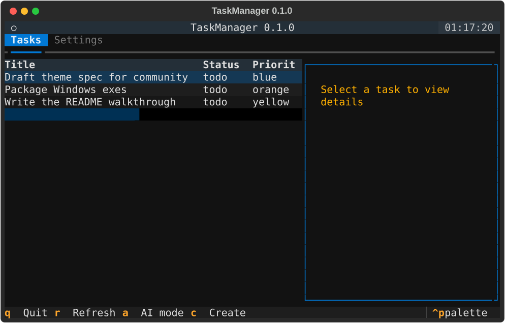

# BoardAgent — a task board for you and your AI agents

BoardAgent is a task manager that lives on your computer. You use it like
a normal to-do list. The difference: AI agents (Claude, Cursor, Hermes)
can see the same board, pick up tasks, and mark them done — without you
copy-pasting anything between tools.

Everything stays on your machine. No account, no cloud, no subscription.
Your tasks live in a single file on your disk (a few small settings files
live alongside it).

## What you see

When you open BoardAgent you get a terminal window with two tabs:

- **Tasks** — your task list. Columns: Title, Description, Tags, Estimate,
  Status, Priority, Project, Due.
- **Settings** — pick a theme, turn on AI mode, change opacity, set up the
  server, manage API keys, remap keys.

Press **Tab** to switch between the two tabs.

## 60-second quickstart

1. Start the server (it runs in the background and stores your tasks):
   `boardagent-server`
2. Open the task board:
   `boardagent`
3. Press **c** to create your first task. Fill in a title, then activate
   the **Create** button (Enter or Space on it) — and you have a task on
   the board.

That's it. You now have a working task manager.

## Keyboard basics

You never need the mouse. Here are the keys you will use most:

- **Arrow keys** — move up and down the task list.
- **Space** — select a task (its details appear in the right panel).
- **Enter** — activate the highlighted button or item.
- **c** — create a new task.
- **e** — edit the selected task.
- **d** — delete the selected task.
- **l** — claim a task (mark it as yours and in progress).
- **t** — complete the selected task.
- **r** — refresh the list from the server.
- **a** — toggle AI mode (see below).
- **Escape** — close a dialog (on the main screen: quit).
- **q** — quit.

The mouse works too — click to select, scroll to move — but the keyboard
is faster once you know the keys.

## Creating a task

Press **c** and you get a form. The fields:

- **Title** — what the task is.
- **Project** — group tasks under a project name.
- **Description** — more detail.
- **Tags** — comma-separated labels (e.g. `bug, urgent`).
- **Estimate** — how long you think it takes (e.g. `2h`, `1d`).
- **Links** — comma-separated URLs related to the task.
- **Acceptance** — what "done" looks like for this task.
- **Dependencies** — comma-separated IDs of tasks that must finish first.
- **Notes** — one note per line.
- **Priority** — a color: white, blue, green, yellow, orange, red (red is
  highest).

You can also add your own custom fields with **Add Field** (name = value)
and remove them with **Remove Field**. Only Title is required; everything
else is optional.

## What is AI mode?

Press **a** to toggle AI mode. The task list grows extra columns that
matter when agents are working alongside you:

- **ID** — the task's unique identifier (agents use this to refer to tasks).
- **Links** — related URLs.
- **Acceptance** — the done-criteria for the task.
- **Dependencies** — other tasks that must finish first.
- **Notes** — free-form notes, one per line.
- **Agent** — which agent (if any) has claimed the task.
- **Metadata** — extra fields agents attach, shown as key = value pairs.

Note: the **Due** column is hidden in AI mode — the extra agent columns
take its place.

Turn AI mode on when you want to see what the agents are doing. Turn it
off for a clean, human-focused view. The choice is saved across restarts.

## API keys (for letting agents in)

If you want an AI tool to read or write your board, it needs an API key.
Create one in **Settings → API Keys**. Three levels:

- **read** — can only look at tasks.
- **write** — can create, edit, claim, and complete tasks.
- **admin** — everything, including deleting tasks and keys.

Start with **read** for anything you are unsure about.

## Where your data lives

All tasks are stored in a single file on your computer, at
`~/.boardagent/boardagent.db` (a database file — think of it as a
spreadsheet that only BoardAgent reads and writes). Nothing leaves your
machine.

## Screenshot

## Where to go next

- To let an AI agent work on your board, see [mcp.md](mcp.md).
- To change colors, see [themes.md](themes.md).
- To run the server in the background on Windows, see [packaging.md](packaging.md).